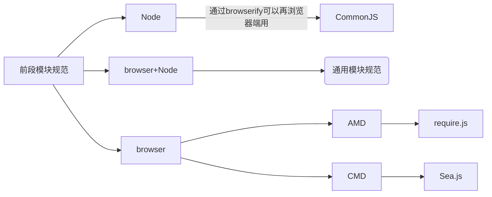

# 模块化




CommonJS

```js
//导出

module.exports = {
    sum,
    sub,
    mul,
    div
}

//导入

const m = require("./mymodel.js")
m.sum(1, 2)
```


es6

```js
//导出
export function sum(){
    
}
//导入
import {sum} from './xxx.js'


```


1. ES6 Module 的导入、导出语句都是声明式的，CommonJS 使用 require 函数动态加载
2. 两者对模块依赖的解决方案，CommonJS 是动态的，ES6 Module 是静态的
3. ES6 Module 可以用静态分析工具检测除哪些模块没有被调用过，从而剔除死代码


301和302区别 ？200和400？

Generator，

高阶函数，

计时器，

localStorage，sessionStorage

浏览器缓存，，协商缓存？强缓存？

渲染机制？页面加载过程？渲染引擎工作原理


单元测试mocha？ ava？

# 正则

```javascript
var re = /^(\d{4})-(\d{4,9})$/;
x = re.exec('0530-12306')
console.log(x)

输出：
[
  '0530-12306',
  '0530',
  '12306',
  index: 0,
  input: '0530-12306',
  groups: undefined
]

```


```javascript
String.prototype.replace(regexp|substr, newSubStr|function)
String.prototype.match(regexp)
String.prototype.exec(str)
String.prototype.test(str)

search() 方法 用于检索字符串中指定的子字符串，或检索与正则表达式相匹配的子字符串，并返回子串的起始位置。
replace() 方法 用于在字符串中用一些字符替换另一些字符，或替换一个与正则表达式匹配的子串。

lastIndex 属性用于规定下次匹配的起始位置。
lastIndex属性只有设置标志 g 才能使用。
上次匹配的结果是由方法 RegExp.exec() 和 RegExp.test() 找到的，它们都以 lastIndex 属性所指的位置作为下次检索的起始点。这样，就可以通过反复调用这两个方法来遍历一个字符串中的所有匹配文本。
注意：该属性是可读可写的。只要目标字符串的下一次搜索开始，就可以对它进行设置。当方法 exec() 或 test() 再也找不到可以匹配的文本时，它们会自动把 lastIndex 属性重置为 0。

search() 方法不执行全局匹配，它将忽略标志 g。它同时忽略 regexp 的 lastIndex 属性，并且总是从字符串的开始进行检索，这意味着它总是返回 stringObject 的第一个匹配的位置。
```

# 浏览器缓存

强缓存优于协商缓存， 

强缓存客户端就能决定。

协商缓存由服务器觉得是否使用缓存，若返回200表示失效重新返回资源， 返回304表示命中，继续使用缓存。

## 强缓存

Expires  强缓存，放到请求头，值为到期时间戳

Cache-Control， 强缓存，放到请求头，几个取值：

- public：所有内容都将被缓存（客户端和代理服务器都可缓存）
- private：所有内容只有客户端可以缓存，Cache-Control的默认取值
- no-cache：客户端缓存内容，但是是否使用缓存则需要经过协商缓存来验证决定--只是不使用强缓存，而不是不缓存
- no-store：所有内容都不会被缓存，即不使用强制缓存，也不使用协商缓存
- max-age=xxx (xxx is numeric)：缓存内容将在xxx秒后失效


Expires和Cache-Control同时存在时， Cache-Control优先


 ## 协商缓存

- Last-Modified/If-Modified-Since
- Etag/If-None-Match

服务器校验优先考虑Etag


# this

nodejs有全局变量global，不同模块中能直接共享，不需要导入。

还有一个全局的this，**默认是一个空对象，即module.exports**，和global没有关系。

浏览器有window，

## 例子

```javascript
//node js中
let obj = {
    foo: function () { console.log(this) },
    bar: 1
};
let foo = obj.foo;
obj.foo()  //obj对象
foo()   //全局的global对象 , 如果'use strict'， 这里打印的是undefined
console.log(this)   //空对象{}
```

```javascript
//浏览器中
let obj = {
    foo: function () { console.log(this) },
    bar: 1
};
let foo = obj.foo;
obj.foo()  //obj对象
foo()   //window对象 , 如果'use strict'， 这里打印的是undefined
console.log(this)   //window对象
```

```javascript
'use strict';
let greet = {
    text: 'hello',
    sayhi: function() { console.log(this.text); },
    sayBye: function() { console.log('Bye'); },
    set: na => {
        this.text = na;
    }
};
greet.set('world');
(greet.text === 'hello' ? greet.sayhi : greet.sayBye)();

//该例子报错。
```


## 变量

```
let x = 1
const y = 2
var z = 3
w = 4
```

nodejs中global包含直接w

浏览器window中包含z和w

但是严格模式下，w=4会报错。

## 按对象调用

**按对象调用指向对象，**在构造函数中也指向对象。

## 单独函数调用

this， 严格模式是undefined， 非严格模式是global或window


函数调用相当于func.call(this, 'Tom')

如果你传的 context 就 null 或者 undefined，那么 window 对象就是默认的 context（严格模式下默认 context 是 undefined）。

## 函数外直接文件中的this

nodejs中指向空对象{}， 浏览器中指向window

## 箭头函数中的this

箭头函数里的this是和外层保持一致的

nodejs中指向空对象{}， 浏览器中指向window

## setTimeout和setInterval（未验证）

window.setTimeout()和window.setInterval()的函数中的this有些特殊，里面的this默认是window对象。
